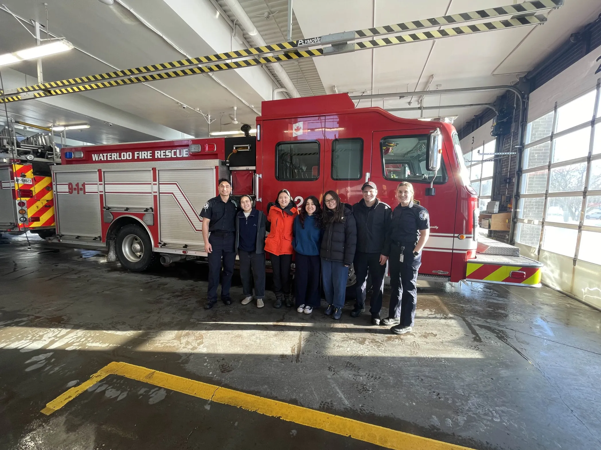

# Abstract 

According to the World Health Organization (WHO), approximately 430 million individuals are deaf or hard of hearing, and studies show they are three times more at risk of being involved in a motor vehicle accident. For hearing impaired drivers, driving requires constant heightened visual awareness of their environment. The objective of AlertRider is to provide real time visual cues of the driver’s surroundings, such as emergency sirens, honking vehicles, and passenger speech. AlertRider is designed with a focus on rideshare drivers (eg. Uber & Lyft), to ensure safe and clear passenger-driver communication. The implementation utilizes a Raspberry Pi alongside a microphone and screen, powered by the car's battery. The program involves signal classification methods such as bandpass filters and ML models that can classify external sounds, along with key passenger phrases within the car. Once detected, the screen displays a clear visual alert to the driver, signaling the audio that was captured. AlertRider’s main advantage over existing technologies is that it can be integrated into any car model, unlike Hyundai’s hearing impaired assistance which is only available in certain models. Additionally, our tool offers passenger speech conversion which is not available in existing tools.



# Models:
1. Siren ML model uses Tenserflow's [YAMNet](https://www.tensorflow.org/hub/tutorials/yamnet)
2. Speech detection model uses [Vosk](https://alphacephei.com/vosk/)

# How to run:

make sure you have python 3 installed. Run this to check

```python --version```

create a virtual environment

```python3 -m venv venv```

NOTE: Python Tkinter must be installed for the UI -> `brew install python-tk@3.12`
if using tkinter:
```/opt/homebrew/opt/python@3.12/bin/python3.12 -m venv venv```

enter the virtual python environment. do this by running:

```source venv/bin/activate```

install packages

```pip install -r requirements.txt```

run the project

```python src/main.py```

## Installed Vosk model
```
curl -L -o vosk-model-en-us-0.22.zip https://alphacephei.com/vosk/models/vosk-model-en-us-0.22.zip

unzip vosk-model-en-us-0.22.zip -d models/

```
