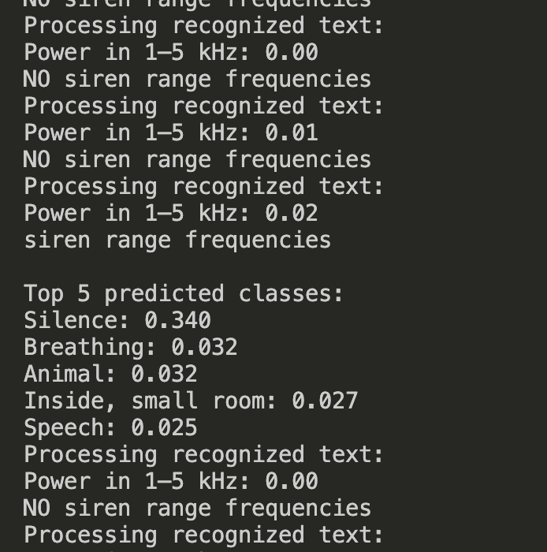

# Info:
1. siren ML model uses tenserflow yamnet
2. speech detection model uses vosk
3. the passenger speech detection is bad because you have to yell. 
4. tensorflow cannot be used on the raspberry pi. we must use tensorflow LITE

## Branches
main - contains code that can run on your laptop

raspberry_pi - contains code that can run on the pi / mimic running on the pi

# How to run:

*the code is in the /src directory**

clone this github repo on your local desktop

make sure you have python 3 installed. Run this to check

```python --version```

create a virtual environment

```python3 -m venv venv```

NOTE: Python Tkinter must be installed for the UI -> `brew install python-tk@3.12`
if using tkinter:
```/opt/homebrew/opt/python@3.12/bin/python3.12 -m venv venv```

enter the virtual python environment. do this by running:

```source venv/bin/activate```

install packages

```pip install -r requirements.txt```


run the file

```python src/main.py```

if you get an error that a package isnt installed, install it:

```pip install some-package```

## Output
Will look something like 



## Auto Startup
to stop the program, run `systemctl --user stop alertrider.service`
